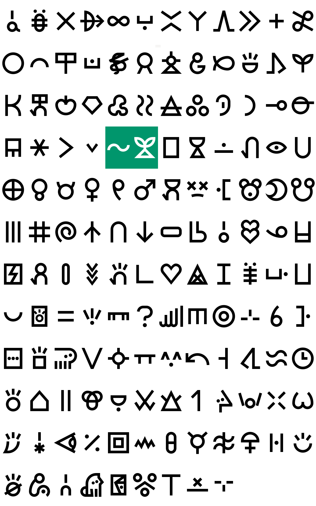

# linja laso
(laso pi mute ante li pali e linja ni e lipu ni)
### current version: 0.9

this is a little font i'm making, based on a grid and with sharp edges! More about [how](https://github.com/cvni1981/linja-laso/wiki).

recently undergone a big redesign! the font is now thicker and less cobbled-together-looking.

any and all quibbles may be sent to muteante@gmail.com

### currently has:
- nimi pu ale, nimi ku suli ale
- cartouched glyphs `[ ]`, morae dots `. (period) · (interpunct) :`

### will (hopefully soon) have:
- nimi ku lili ale
- personal glyphs (priority on those who Need them to be identified)
- toki pona radicals
- tuki tiki
- vertical version
