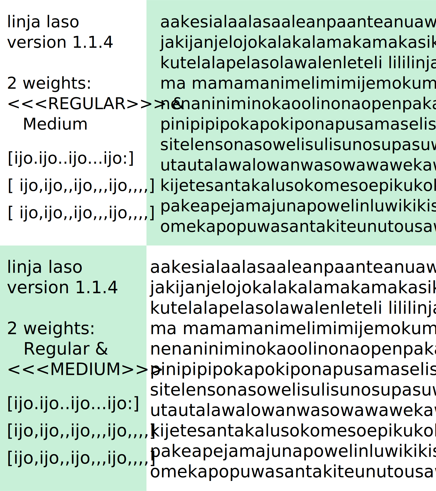

# linja laso
(mute ante li pali e linja ni e lipu ni)
### current version: 1.1.4

this is a little font i'm making, based on a grid and with sharp edges! More about [how](https://github.com/cvni1981/linja-laso/wiki).

Features 2 weights: regular (closer to linja lipamanka) and medium (thickness based on nasin-nanpa).

And 3 versions:
* **Regular** automatically combines latin into sitelen pona
* **UCSUR** doesnt do that, requires a [UCSUR-compatible input engine](https://github.com/neroist/sitelen-pona-ucsur-guide?tab=readme-ov-file)
* **NotoSans** is a version of Noto Sans with linja laso injected. Since Discord uses Noto Sans as a backup font, this is an easy way to get sitelen pona in Discord without CSS modification!

### currently has:
* nimi pu ale, nimi ku suli ale, some ku lili
* cartouched glyphs `[ ]`, morae dots `. (period) · (interpunct) :`, tickmarks `, (comma)`
* half-width spaces can be enabled with SS01*
* indented tickmarks for smaller sizes can be enabled with SS02*
*\* the NotoSans versions don't have these style sets *

**recommended line height for body text:**
* regular: 166.6%
* medium: 160%

### will (hopefully soon) have:
* all alts
* nimi ku lili ale
* personal glyphs (priority on those who Need them to be identified)
* toki pona radicals
* tuki tiki
* vertical version
